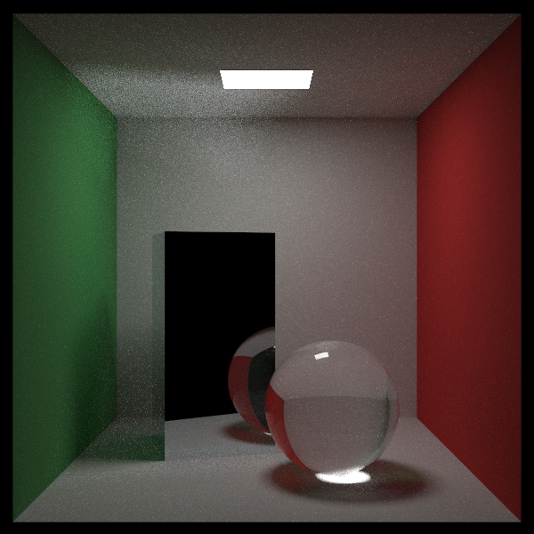

# ray-tracing-the-rest-of-your-life-cpp

This repository is C++ implementation of Peter Shirley's [Ray Tracing: The Rest of Your Life](https://raytracing.github.io/books/RayTracingTheRestOfYourLife.html). The code is built on C++17 and can be compiled with commonly available compilers such as g++, clang++, or Microsoft Visual Studio. It currently supports macOS (10.14 or later), Ubuntu (18.04 or later), Windows (Visual Studio 2017 or later), and Windows Subsystem for Linux (WSL). Other untested platforms that support C++17 also should be able to build it.

## Related Repositories

  * [ray-tracing-in-one-weekend-cpp](https://github.com/utilForever/ray-tracing-in-one-weekend-cpp)
  * [ray-tracing-the-next-week-cpp](https://github.com/utilForever/ray-tracing-the-next-week-cpp)

## Acknowledgement

I would like to thank [Peter Shirley](https://twitter.com/peter_shirley) for providing the excellent original book.

## Contact

You can contact me via e-mail (utilForever at gmail.com). I am always happy to answer questions or help with any issues you might have, and please be sure to share any additional work or your creations with me, I love seeing what other people are making.

## License

The class is licensed under the [MIT License](http://opensource.org/licenses/MIT):

Copyright &copy; 2020 [Chris Ohk](http://www.github.com/utilForever).

Permission is hereby granted, free of charge, to any person obtaining a copy of this software and associated documentation files (the "Software"), to deal in the Software without restriction, including without limitation the rights to use, copy, modify, merge, publish, distribute, sublicense, and/or sell copies of the Software, and to permit persons to whom the Software is furnished to do so, subject to the following conditions:

The above copyright notice and this permission notice shall be included in all copies or substantial portions of the Software.

THE SOFTWARE IS PROVIDED "AS IS", WITHOUT WARRANTY OF ANY KIND, EXPRESS OR IMPLIED, INCLUDING BUT NOT LIMITED TO THE WARRANTIES OF MERCHANTABILITY, FITNESS FOR A PARTICULAR PURPOSE AND NONINFRINGEMENT. IN NO EVENT SHALL THE AUTHORS OR COPYRIGHT HOLDERS BE LIABLE FOR ANY CLAIM, DAMAGES OR OTHER LIABILITY, WHETHER IN AN ACTION OF CONTRACT, TORT OR OTHERWISE, ARISING FROM, OUT OF OR IN CONNECTION WITH THE SOFTWARE OR THE USE OR OTHER DEALINGS IN THE SOFTWARE.